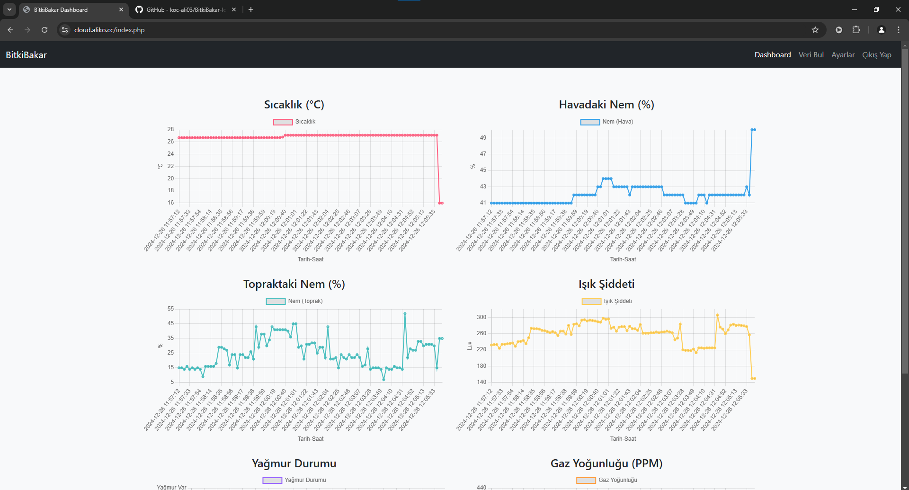

# BitkiBakar-IoT

ESP8266 ve bir sunucu kullanarak bitki sağlığını izlemek için temel bir IoT projesi.

## Bağımlılıklar

Aşağıdaki bileşenlerin kurulu olduğundan emin olun:

- **Arduino Kütüphaneleri**:
  - `ESP8266WiFi`
  - `ESP8266HTTPClient`
  - `ArduinoJson`
  - `DHT sensör kütüphanesi`
- **Sunucu Tarafı Kodları İçin PHP**

Arduino kütüphanelerini Arduino Kütüphane Yöneticisi üzerinden kurabilirsiniz (`Sketch > Include Library > Manage Libraries...`).

## Kullanılacak Bileşenler

Bu projede aşağıdaki bileşenler gereklidir:

- **ESP8266 NodeMCU** (Wi-Fi bağlantısı için)
- **DHT11** (Sıcaklık ve nem sensörü)
- **Toprak Nem Sensörü**
- **LDR** (Işık sensörü)
- **MQ-135** (Hava kalitesi sensörü)
- **CD74HC4067** (Çoklu kanal analog veri okuma için)
- **Su Seviyesi Sensörü**
- **Breadboard** (Bağlantılar için)
- **Breadboard Güç Kaynağı**
- **Jumper Kabloları** (Bağlantı yapmak için)

### 1. NodeMCU için
1. `nodemcuConfig.example.h` dosyasını `nodemcuConfig.h` olarak değiştirin.
2. Wi-Fi kimlik bilgilerinizi ve sunucu bilgilerinizi doldurun:
   ```cpp
    const char* WIFI_SSID = "wifi-ssid-buraya";
    const char* WIFI_PASSWORD = "wifi-sifreniz-buraya*";
    const char* SERVER_URL = "server-url-buraya";
    const char* API_KEY = "api-anahtari-buraya";
   ```
3. Arduino IDE'sinde NodeMCU kaynak kodunu açın ve ESP8266'ya yükleyin.

### 2. Sunucu için
1. `sensitive_data.example.php` dosyasını `sensitive_data.php` olarak değiştirin.
2. Veritabanı kimlik bilgilerinizi ve gerekli diğer hassas verileri doldurun:
    ```php
    // Veritabanı bilgileri
    define('DB_HOST', 'host-adi-buraya');
    define('DB_NAME', 'veritabani-adi-buraya');
    define('DB_USER', 'kullanici-adi-buraya');
    define('DB_PASS', 'veritabani-sifresi-buraya');

    // API anahtarı
    define('API_KEY', 'api-anahtari-buraya');

    // E-Mail Bildirim sistemi bilgileri
    define('MAIL_SIFRE', 'mail-sifresi-buraya');
    ```
3. Sunucu tarafı dosyalarını web sunucunuza yükleyin.

## Devre Şeması


## Arayüz Görselleri

### Veri filtreleme sayfası


### Ayarlar sayfası
